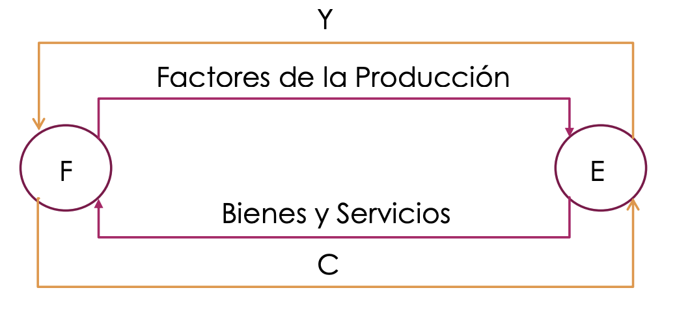
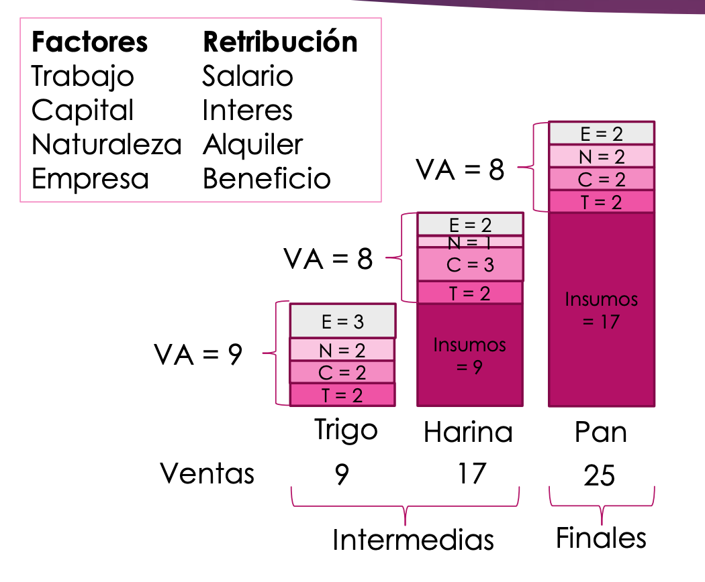
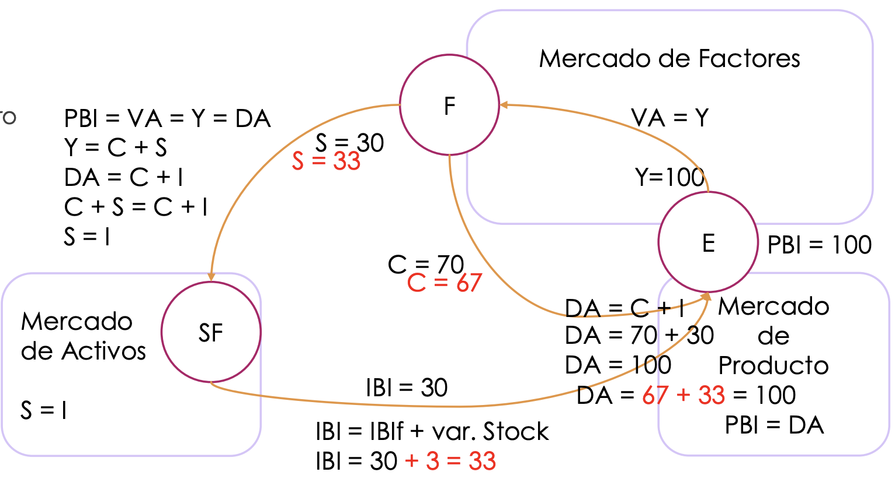
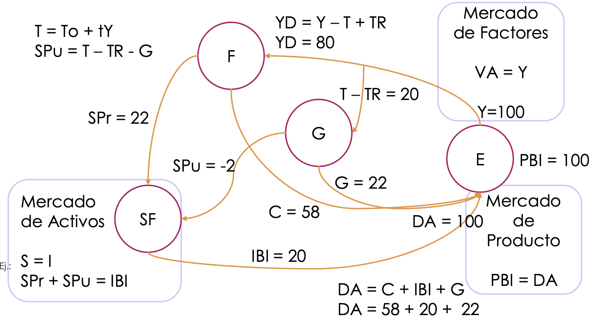
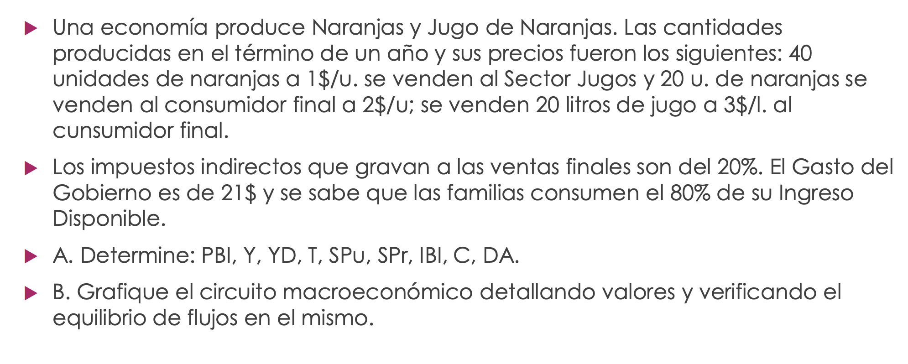

# Unidad 1: Macroeconomía como un flujo circular

- [Unidad 1: Macroeconomía como un flujo circular](#unidad-1-macroeconomía-como-un-flujo-circular)
  - [Clasificación de bienes](#clasificación-de-bienes)
  - [Clasificaciones de unidades económicas (sectores)](#clasificaciones-de-unidades-económicas-sectores)
  - [Economía sencilla con dos sectores:](#economía-sencilla-con-dos-sectores)
  - [Economía con tres sectores](#economía-con-tres-sectores)
  - [Economía con cuatro sectores](#economía-con-cuatro-sectores)
  - [Ejercicio de clase](#ejercicio-de-clase)

## Clasificación de bienes

- **Productos**: bienes y servicios.
- **Factores de la producción**: 

Retribución de los factores: 
- Trabajo -> salario
- Capital -> interés
- Naturaleza -> Alquiler
- Empresa -> benerficio

- **Activos**: reales y financieros. 

## Clasificaciones de unidades económicas (sectores)

- **F**amilias
- **E**mpresas: sector productivo
- **SF**: Sector Financiero
- **G**obierno
- **RM**: Resto del mundo

## Economía sencilla con dos sectores:

(*siglas*)
- **Y**: Ingreso
- **C**: Consumo
- **VA**: Valor agregado
- **PBI**: Producto Bruto Interno
- **DA**: Demanda agregada

---

**FORMULAS**

VA = Y = PBI = DA

---

### Análisis de un sector: 

*(siglas)*
- **VBP**: Valor Bruto de la Produccion
- **EBE**: Excedente Bruto de Explotación

--- 

**FORMULAS**

VBP =  todas las ventas = 9 + 17 + 25 = 51
Insumos = bienes intermedios = 9 + 17 = 26
PBI = VPB - Insumos = 51 - 26 = 25 = productos finales = 9 + 8 + 8 = 25
VA = 9 + 8 + 8 = 25
EBE = (Intereses + Alquileres + Beneficio + Consumo De Capital Fisico) = (2+3+2) + (2+1+2) + (3+2+2) = 19
Y =  Salarios + EBE = (2+2+2) + 19 = 25

Se cumple que: **PBI = Y = DA = VA**

---

## Economía con tres sectores

*(siglas)*
- **S**: ahorro
- **IBI**: inversión bruta interna
  - **IBIf**: inversión bruta interna fija
- **I**nversión
  
--- 

**FORMULAS**

**PBI = Y = DA = VA** 

*El ingreso es el consumo más el ahorro*
Y = C + S

*Demanda agregada es el consumo y la inversión*
DA = C + I

C + S = C + I

*El ahorro es igual a la inversión*
S = I 

*El valor agregado es igual al ingreso*
VA = Y

*¿Que pasaría si las empresas hubieran estudiado mal la demanda? Se almacena stock. Aumenta el aahorror pero no aumenta la inversión. La acumulación de inventario es una inversión. *
IBI = IBIf + var_stock

---

## Economía con cuatro sectores

*(siglas)*
- **G**: gobierno Y gastos del gobierno
- **SPr**: ahorro del sector privado
- **SPu**: ahooro dle sector público (del gobierno)
- **T**: Total de ingresos del gobierno
- **TR**: Transferencias del gobierno (ej.: asignación universal por hijo)
- **To**: Impuestos de suma fija. 
- **t**: tasa impositiva sobre el ingreso
- **YD**: ingreso neto

--- 

*El ingreso del gobierno es el fijo más la tasa sobre el ingreso*
T = To + t(Y) 

*El ahorro del publico es todo lo que recauda menos lo que gasta y lo que trasfiere*
SPu = T - TR - G

S = I 

*Si el ahorro del público es menor que cero (deuda) tenemos menos inversión*
SPr + SPu = IBI

*El ingreso neto es el ingreso lo que le quita le gobierno más las transferencias que recibe del mismo*.
YD = Y - T + TR  

*El valor agregado es el ingreso*
VA = Y

*El PBI es lo que las empresas producen*

*La demanda agregado es lo que le vuelve a las empresas*
DA = C + IBI + G

Se cumple que: **PBI = Y = DA = VA**

---

## Ejercicio de clase

A) 

PBI = VPB - Insumos

VBP = todas las ventas = 40u * 1 \$/u + 20u * 2 \$/u  + 20l * 3 \$/u  = 140$  \$

(*el único que no se vende al cf*)
Insumos = 40u * 1 \$/u = 40 \$

PBI = 100 \$

DA = PBI = 100 /$

Y = PBI = 100 \$

YD = Y - T + TR

T = 0.2 (20u * 2 \$/u  + 20l * 3 \$/u ) = 20 \$

TR = 0 

*no hay impuestos de suma fija*

YD = 100 \$ - 20 \$ = 80 \$

G = 21

SPu = T - G -TR = -1 \$

SPr = 0.2 \% 80 \$ = 16 \$

IBI = I = SPu + SPr = 15 \$

*La demanda agregada es lo que le vuelve a las empresas!*
PBI = DA = C + G + IBI 

C = 100 \$ - G - IBI = 64 \$ 

---

**OTRAS MANERAS DE CALCULAR EL PBI**

VAn: valor agregado de la naranja
VAj: valor agregado del jugo

PBI = VA = VAn + VAj = (40*1 + 20*2) + (20*3- 40*1) = 100

PBI = ventas finales = 20*2 + 20 * 3 = 100

---