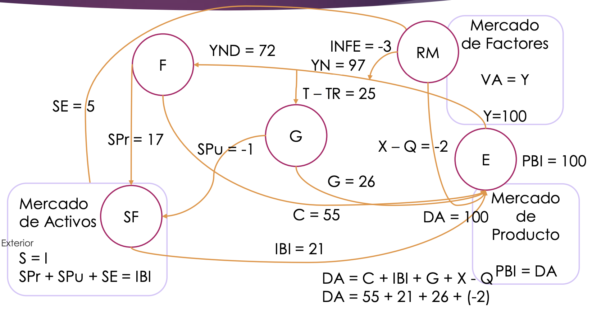
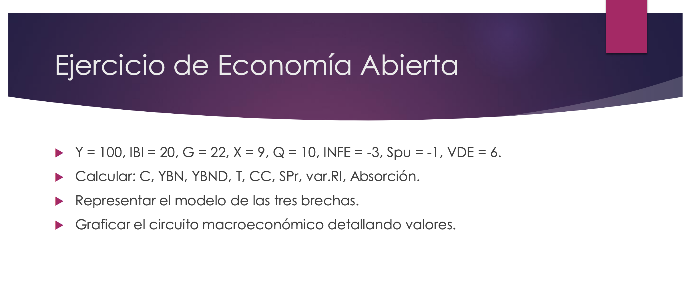

# Unidad 2: Economía abierta

- [Unidad 2: Economía abierta](#unidad-2-economía-abierta)
  - [Balanza de pagos](#balanza-de-pagos)
  - [Economía abierta](#economía-abierta)
  - [Enfoque de absorción](#enfoque-de-absorción)

## Balanza de pagos

Es la principal herramienta contable que registra las transacciones entre los residentes de un país  y los residentes del resto del mundo. 

**Cuenta corriente**: transacciones corrientes entre residentes y el RM. Se dividie en tres:

- Bienes y servicios
  - X: Exportaciones
  - Q: Inversiones

- Ingresos primarios (rentas): interés, utilidades, dividentos, salarios, alquileres, es decir, **factores de la producción**. 

  - Créditos: lo que reciben los residentes por haber aportado al RM. 
  - Débitos: lo que las familias (no residentes) aportan a la producción local en factores de la producción. 

- Ingreso secundarios (transferencias corriente): donaciones o jubilaciones de personas que han migrado. 

**Cuenta de capital**: movimientos pequeños (no nos interesarán mucho)

**Cuenta financiera**, abarca tres cosas:

- Variación de la inversión directa que pueden hacer residentes en el RM como la que realizan los residentes del RM en el país. 
- Variación de la deuda externa. 
- Variación del stock de las reservas (nacionales) en los bancos internacionales. 

*(siglas)*
- **X**: exportaciones
- **Q**: importaciones
- **INFE**: ingreso neto de los factores del exterior.
- **CC**: cuenta corriente
- **CK**: cuenta capital
- **CF**: cuenta financiera
- **NTC**: neto de las transacciones corrientes
- **VII**: variación de la inversión internacional
- **VD**: variación de la deuda
- **VRI**: variación de los resultados internacionales
- **SE**: ahorro externo

---

**FORMULAS**

CC + CK = CF

CC = X - Q + INFE + NTC

CF = VII + VD + VRI

VRI = CC + CK - VII - VD

*el ahorro externo es el déficit de la cuenta corriente, lo que se endeuda.*

SE = - CC = CK - CF

---

## Economía abierta

*(siglas)*
- **YN**: ingreso neto
- **YND**: ingreso neto disponible

--- 

**FORMULAS**

Siempre se cumple que: **PBI = Y = DA = VA**, esto es que la oferta es igual a la demanda. 

Siempre se cumple que: **S = I** el ahorro es igual a la inversión. 

SPr + SPu + SE = IBI

DA = C + IBI + G + X - Q

X - Q es como el consumo del resto del mundo. 

YN = Y + INFE

SE = - CC = CK - CF = X - Q + INFE

---

## Enfoque de absorción

*(siglas)*

A: absorción interna. 
YBN: ingreso bruto interno

---

**FORMULAS**

A = C + I + G

PBI = A + X - Q

YBN = PBI + INFE

YBN =  A + X - Q + INFE

YBN = A + CC

(*si CC < 0 hay exceso de absorción sobre el YN*)
YBN - A = CC 

---

## Enfoque ahorro-inversión y las tres brechas

*(siglas)*

SN: ahorro nacional
VD = variacion de la deuda externa
VII = variación de la inversión internacional
VRI = variación de reservas internacionales

---

**FORMULAS**

I = S

I = SPr + SPu + SE 

I = SPr + (T - TR - G) - CC 

SPR - I =  (G + TR - T) + CC

SPr + SPu - I = CC

SN - I = CC

CC + CK = CF

CC + CK = VII + VD + VRI

CC + CK - VII - VD - VRI = 0

CC =  - CK + VII + VD + VRI

SN - I = VII + VD + VRI - CK

---

