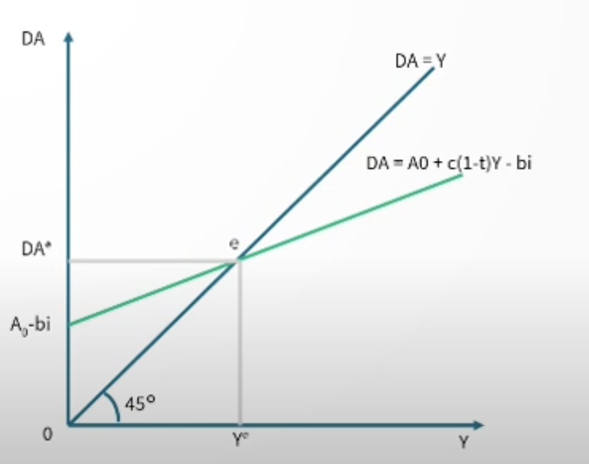
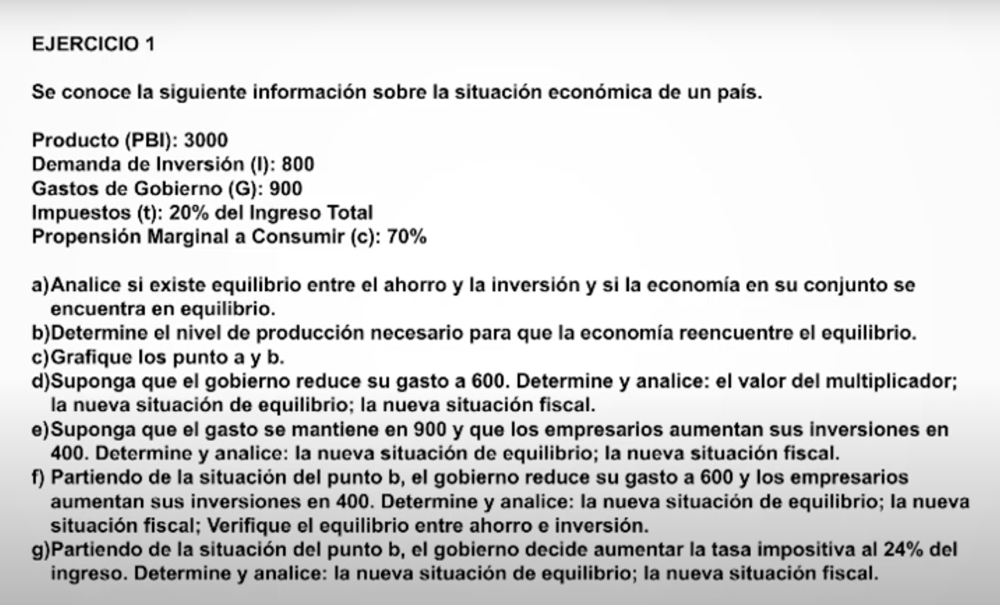
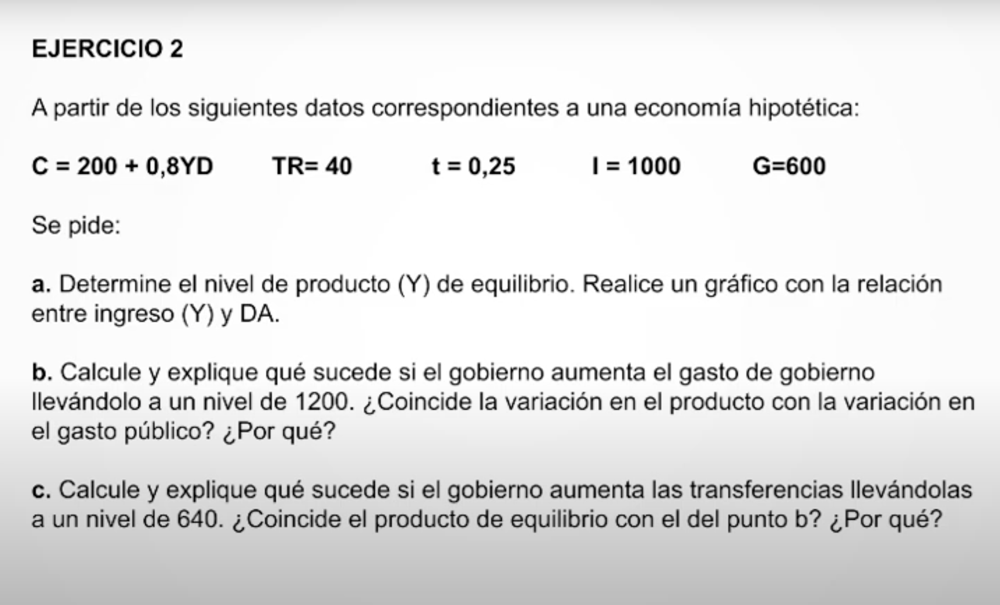

# Unidad 4 Determinación del Ingreso de Equilibrio en el Modelo Ingreso-Gasto

## Determinación del ingreso de equilibrio en economía cerrada (cuatro sectores)

DA = C + I + G

C = Co + c YD 

c = PMgC: proporción marginal a consumir

YD = Y - To - tY + TR

C = Co + c (Y - To - tY + TR)

I = Io - b i 

i: tasa de interes

b: sensibilidad de la inversión a la tasa de interés

DA = Co +  c (Y - To - tY + TR) + Io - bi + G

Ao: Gasto autónomo (no depende de Y ni de i)= Co - c To + c TR + Io + G

DA = Ao + c (1-t) Y - bi

Y = DA  -> **esto es lo que queremos hallar**

Y = Ao + c (1-t) Y - bi

Y = (Ao - bi) (1/(1-c(1-t)))

mg: multiplicador del gasto = 1/(1-c(1-t))

Es un multiplicador porque hay un aumento que hace que aumente el ingreso, si aumenta el ingreso aumenta el consumo y si aumenta el consumo el ingreso. 

Y = mg (Ao - bi)

En los niveles mayores al del ingreso del equilibrio, el nivel de producción es mayor que el de demanda. Se produce una acumulación de stock que se denomina Inversión no planeada (INP). 

En los niveles menores, la demanda es mayor que la oferta. Desinversión no planeada (DNP). En el corto plazo, las empresas deben deshacerse del stock.  

Esto explica porqué fluctua el mercado.

Ao + c (1-t) Y - bi

## Ejercicio

PBI = 3000
I = 800
G = 900
t = 20%
c(PMgC) = 70%

**a) Analice si existe equilibrio entre el ahorro y la inversión y si la economía en su conjunto se encuentra en equilibrio.**

**siempre se cumple que el ingreso es igual al PBI**

DA =  Co +  c (Y - To - tY + TR) + Io - bi + G = 0 + 0,7(3000 - 0 - 0,2 3000) + 800 + 900 =

DA = 3380 > Y

No hay equilibrio. 

*mercado del ahorro y la inversión*

SPu = T - TR - G = 0,2 3000  - 900 = - 300

C =  Co + c (Y - To - tY + TR) = 0,7 (3000 - 0,2 3000) = 1680

Spr = YD - C =  Y - To - tY + TR - C = 3000 - 0,2 3000 - 1680 = 720

S = Spu + Spr = - 300 + 720 = 420

S < I 

No hay equilibrio (se puede suponer de lo de antes.)

**b) Determine el nivel de producción necesario para que la economía encuentre el equilibrio.**

Y* = DA =  mg (Ao - bi) = 1/(1-c(1-t)) (Co - c To + c TR + Io + G - bi) =  1/(1-0,7(1-0,2)) (900+800) = 3863,4

**c) tu vieja va a graficar.**

**d) Suponga que el gobierno reduce su gasto a 600. Determine y analice; el valor del multiplicador; la nueva situación del equilibrio. La nueva situación fiscal.**

El valor del multiplicador es el mismo. 

Ao  = 1700

(creo que esta asumiendo b o i = 0)

Ao' = Ao - 300  = 1400

mg: se mantiene = 1/(1-c(1-t)) = 2,27

Y' = 2,27 1400 = 3181,81

La situación fiscal es el nuevo ahorro del públic

T = To + tY' =  0,2 3181,1 =  636,22
Spu = T - G = 636,22 - 600 36,22   **super habit fiscal**

**e) Suponga que el gasto se mantiene en 900 y que los empresarios aumentan sus inversiones en 400. Determine y analice: la nueva situación de equilibrio; la nueva situación fiscal.**

Ao' = 1700 + 400 = 2100

Y' = 2,27 2100 = 4767

T = 0,2 4767 = 953,4

Spu = T - G = 953,4 - 900 = 53,4

**f) Partiendo de la situación del punto b, el gobierno reduce su gasto a 600 y los empresarios aumentan sus inversiones en 400. Determine y analice: la nueva situación de equilibrio; la nueva situación fiscal; verifique el equilibrio entre ahorro e inversión.**

Se opera igual que antes. Hay super habit también.

## Política fiscal en economía cerrada (cuatro sectores)

### Herramientas de politica fiscal

Actuan sobre el Ao (se modifica la ordenada al origen): 
    To; TR; G

Actúan sobre c; t (se modifica la pendiente).

**Política fiscal expansiva** para estimular la DA (gasto):

- Aumento TR o G
- Disminución de To o t

**Política fiscal contractiva** para enfriar la economía (bajar la inflación):
- Disminución de TR o G
- Aumento de To o t

## Ejercicio 2

**a) Determine el nivel de producto Y de equilibrio. Realice un gráfico con relación entre ingreso Y y (DA)** 

c = 0.8 

mg = 1/(1-0.8(1-0,25)) = 2,5

Ao = Co - c To + c TR + Io + G 

Y = (Ao - bi) (1/(1-c(1-t))) =  (200 + 0,8 40 + 600 + 1000) * 2,5 = 4580

**b) Calcule y explique qué sucede si el gobierno aumenta el gasto de gobierno llevandolo a un nivel de 1200. ¿Coincide con la variación en elpr4oducto con la variación en el gasto público? ¿por qué?**

Ao aumento en 200 

Y' = 2432 * 2,5 = 6080

La variación es de = 1500

No, por el efecto multiplicador. 

**Calcule y explique qué sucede si el gobierno aumenta las transferencias llevandolas a un nivel de 640. ¿Coincide el punto de equilibrio con el del punto b? ¿Por qué?** 

Ao aumenta en 600 **\*0,8**. No va a aumentar lo mismo porque la variación del gasto autónomo no es igual.  

