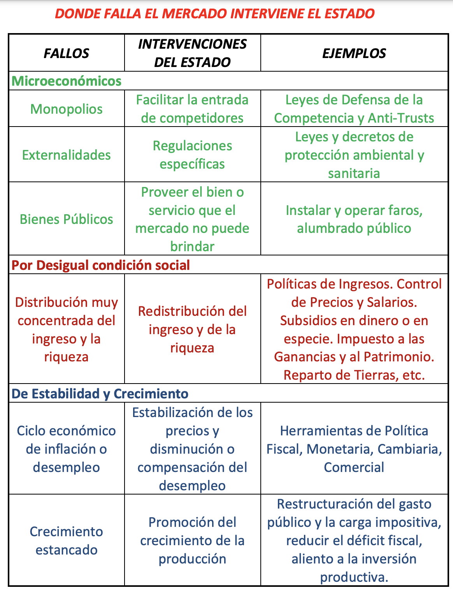

RESUMEN TEORICA 
---

- [El capitalismo contemporáneo](#el-capitalismo-contemporáneo)
    - [Breve perfil del sistema tributario argentino](#breve-perfil-del-sistema-tributario-argentino)
  - [Donde falla el mercado interviene el estado](#donde-falla-el-mercado-interviene-el-estado)
- [¿Qué estudia la macroeconomía?](#qué-estudia-la-macroeconomía)
- [Crecimiento y desarrollo económico](#crecimiento-y-desarrollo-económico)
  - [Factores condicionantes del crecimiento económico](#factores-condicionantes-del-crecimiento-económico)
  - [Causas que explican el  crecimiento de la productividad](#causas-que-explican-el--crecimiento-de-la-productividad)
  - [Crecimiento económico desigual](#crecimiento-económico-desigual)
  - [Costos del crecimiento económico](#costos-del-crecimiento-económico)
  - [¿Qué es el desarrollo y en qué se diferencia del crecimiento económico?](#qué-es-el-desarrollo-y-en-qué-se-diferencia-del-crecimiento-económico)
  - [Seis factores del desarrollo económico](#seis-factores-del-desarrollo-económico)
  - [Elementos condicionantes del subdesarrollo](#elementos-condicionantes-del-subdesarrollo)
  - [Enfoques diferentes en cuanto a políticas económicas para el desarrollo](#enfoques-diferentes-en-cuanto-a-políticas-económicas-para-el-desarrollo)
- [Teoría del ciclo económico](#teoría-del-ciclo-económico)
  - [Recesión distinto de depresión](#recesión-distinto-de-depresión)
  - [¿Qué hacer frente a la crisis?](#qué-hacer-frente-a-la-crisis)

# La Ciencia Económica y sus datos

## Economía, ciencia política. Diversidad de enfoques teóricos. Objetividad y neutralidad

La economía surge de la **necesidad** de develar los procesos sobre los cuales reposan las modernas formas mercantiles de relacionarse las personas entre sí a los fines de llevar adelante la producción y el intercambio de la riqueza social. 

> Se busca entender como los agentes privados logran resolver el **problema económico**: qué, cómo y para quién producir. 

> En sus orígenes a la economía se la llamaba **economía política** ya que el objeto de estudio es la sociedad. 

La economía registra tanto en los aportes de las escuelas de pensamiento económico como también en los principales problemas que ellas abordan, que surgen de la naturaleza conflictiva de la sociedad. 

La valoración de los problemas socio-económicos y los lineamientos para su abordaje desde el Estado se especifican de acuerdo con el ángulo y la **interpretación** de hechos complejos porque resultan de múltiples factores, **y todo ello partiendo de los supuestos de la realidad compatibles con los valores, intereses y educación de cada economista.** 

> El **problema económico** genera normalmente respuestas múltiples, todas ellas científicas aunque se muestren contradictorias entre sí. Entonces, el conflicto entre las escuelas del pensamiento económico por sostener prioridades diferentes y soluciones contrapuestas no cuestiona la validez científica de ninguna de ellas. 

El pensamiento resulta científico cuando sostiene supuestos y análisis racionales acerca de la realidad y se apoya en marcos teóricos contrastables con los hechos. 

### La economía y el maldito caracter político de su objeto

- Las características políticas de la ciencia económica explica la pluridad de escuelas en competencia. 
- Los campos de estudio resultan cuestionados y/o privados de méritos científicos si traslucen permeabilidad y funcionalidad respcto de los debátes ideológicos y políticos emergentes del conflicto social. Esto surge del paradigma de la fisica que busca ocultar las raíces políticas e ideológicas que sostienen las investigaciones científicas tanto en el campo de lo social como en el de lo natural. 
- Entonces, se debería sacrificar la pretención de neutralidad como condición de la objetividad científica en general. Esto es porque el conocimiento **pertenece a un cierto marco histórico y político**

## Leyes, Teorías y modelos Económicos

- **Ley**: describe un fenómeno
- **Teoría**: intenta explicar la ley
- **Modelos**: ofrecen un analisis detallado entre ciertas variables y aspectos específicos del fenómeno mediante graficos, algoritmos, esquemas, funciones y demás recursos análiticos y expositivos. 

> **Modelos económicos**: herramientas analíticas que mediante supuestos recortan la realidad para simplificar ciertas relaciones y comportamientos, excluyendo del estudio a los demás factores qu también actúan en el mundo real. 

Ej.: De un modelo económico cuantitativo se espera que al menos pueda captar el signo previsible y el órden de magnitud de los procesos que estudia. 

Al tratarse de modelos factores, las leyes y los modelos de la economía deben considerarse sólo como: **la descripción probable de tendencias subyacentes**. Para que una tendencia se manifieste resulta de las circunstancias contingentes que influyen sobre esas tendencias, haciendo que una se imponga sobre las demás. 

> Segun Marshall: una **ley social** es una manifestación de **tendencias sociales**, es decir, una afirmación de que puede esperarse que los miembros de cierto grupo o núcleo social adoptarán una determinada línea de comando bajo ciertas circustancias. 

Entonces, 

> Según Marshall: una **ley económica** o manifestación de tendencias económicas, son aquellas leyes sociales que se refieren a ramas de conducta en que la fuerza de los principales móviles puesde ser medida por medio de un precio en dinero. 

O sea, "la linea de comando" es la conducta que tomaran los móviles y esa conducta puede ser media por medio de un precio en dinero. 

Si alguien no sometiera su conducta a leyes económicas, con el paso del tiempo tendría problemas para garantizar su participación social e incluso su subsistencia. Ej.: vender algo muy caro o cobrar honorarios muy altos. 

## Características complejas de la información económica cuantitativa

La **información económica cuantitativa, es decir, los datos económicos** surjen de procesos de **elaboración metodológica** y su selección se funda las necesidades que plantea la teoría económica dominante.

Los **fenómenos socio-económicos** no resultan de una cuantificación puramente observacional o a partir de técnicas. 

> En la economía los aspectos de los hechos que deben explicarse, acerca de los cuales podemos obtener datos cuantitativos son **limitados** y **pueden no incluir lo más importantes**.

>Es improbable que puedan conocerse o medirse por completo todas las circunstancias que determinan el resultado de un proceso. 

Generalmente, en las ciencias sociales, se requiere como importante que resulte ser accesible a la medición, esto lleva hasta el punto de exijir que nuestras teorías se formulen en términos tales que se refieran sólo a magnitudes medibles. **Tal exigencia limita los hechos que habrán de admitirse como causas posibles de los hechos que ocurren en el mundo real.**

La medición de los fenómenos económicos impone la necesidad de **extensos textos metodológicos** para explicar de dónde salen los indicadores que se publican. 

> La **medición**, en la economía, es la mesura de una o más propiedades observables de las diversas dimensiones que componen los conceptos.

Los conceptos están compuestos de dimensiones. Los conceptos y las dimensiones observables mesuradas pueden ser un **indicador**. 

> Las **mediciones serán mejores cuanto más estrecha y directa sea la relación entre lo indicante** (la propiedad observable mesurada como indicador) **y aquello que es indicado** (el concepto o la dimensión del concepto a que el indicador refiere).

Las **cifras no proveen prueba suficiente de consistencia** entre el indicador de magnitud de un hecho o fenómeno y el concepto indicado cuyas magnitudes pretendemos conocer. 

> Esto es, no podemos garantizar que el análisis de los indicadores de un fenómeno equivalga al análisis del fenómeno real entendido en su concepto teórico.

Las cifras económicas no garantizan la obtención de diagnósticos sólidos excepto en casos de obviedad. 

--- 

En **resumen**: 

Las **cifras económicas** surgen de:
1. teorías
2. métodos de relevamiento

Pero debido al 

3. **caracter multicausal** de los fenómenos económicos y sociales

El **criterio del analísta da significado a las cifras** al darle:

4. su relevancia análitica
5. su propia interpretación

---

Un **análisis económico cuantitativo "muestra" pero no "demuestra" nada** si no se acepta su marco teórico, el procedimiento metodológico o su criterio analítico, elementos que dan significado económico a cada cifra.

El análisis de la conyuntura y de la economía en general sirve para comprender la situación actual, para determinar el signo de su evolución futura. 

Los hechos son filtrados por: 

1. "la realidad" no existe fuera de uno u otro marco teórico bajo el que se la estudia. 
2. toda descripción de la realidad económica está permeada por el enfoque particular  del analísta que la recrea. 

Cuando existan fenómenos que contradigan una determinada teoría o modelo, puede hacerse necesaria la **modifiación de ese marco teórico, preservando los componentes esenciales de ese marco.**

Por otro lado, **tampoco es una condición excluyente de todo análisis disponer siempre de cifras para explicar la vida económica.** 

> Las leyes económicas no se **manifiestan** sino en conflicto con otras y no se realizan normalmente sino **bajo la forma de tendencias**, por lo que ninguna estimación cuantitativa puede ofrecer certeza alguna. 

Una visión sólida acerca del curso de los acontecimientos **podría obtenerse en el límite, prescindiendo de los datos cuantitativos y limitándose a una evaluación cualitativa**. 

Sin cálculos matemáticos, el sentido de las tendencias futuras podría vislumbrarse por el análisis de las conductas esperables de los agentes relevantes en la coyuntura de acuerdo con el marco teórico en curso. 

# El capitalismo contemporáneo

Economías mixtas, rol del estado y del mercado, conflicto entre eficiencia y equidad, fallas del mercado. 

La **economía mixta** es la forma contemporanea del capitalismo. Operan las leyes del mercado y de la propiedad privada pero **solo parcialmente porque están acotadas por la intervención del estado.**

Entonces, La forma contemporanea del capitalismo es la economía mixta:

- La **producción y la inversión** están principalmente **a cargo del estado**.

- La **intervención del estado** regula la acción del mercado.

**Dos aspectos de la intervención del estado en la economía**
1) Las acciones de política monetaria, cambiaria, fiscal, de comercio exterior, regulación de precios y salarios, subsidios a las familias y empresas, normativa para la producción y el comercio, entre otras. 
2) La gravitación propia de su estructura organizacional (o sea, como intervienen en los mercado si no es intervención de "leyes"):
   1) en cuanto a los mercados: por el volumen de sus gastos. 
   2) en la estructura socio-ocupacional: por ser el primer empleador. 

La **competencia** de mercado, en el grado en que exista efectivamente, impulsa la **productividad** del trabajo mediante inversiones, innovación técnica en los procesos y en los productos y por consiguiente el **crecimiento** tecnológico. 

> La intervención del estado en los mercados busca compatibilizar la gestión privada de la economía con pautas gubernamentales de distribuición del ingreso. 

Los **consumidores** se esfuerzan por conseguir más a mejor precio y los **productores** reducir costos y aumentar sus ventas. 

> Esta tendencia al **ahorro de la mano de obra** y al **aumento no coordinado de la producción** suele provocar quiebras empresariales y elevados niveles de desempleo que empobrecen al a población. 

Por lo tanto, el **poder político** se elije como tutor del mercado para prevenir los efectos no deseados sobre la equidad distribuitiva a causa del dinamismo y la creciente eficiencia productiva del sistema del mercado. 

> La **regulación estatal** de la economía busca compatiblizar la dinámica productiva propia del mercado, con pautas gubernamentales de distribuición del ingreso, dadas las instituciones políticas y económicas vigentes. 

### Breve perfil del sistema tributario argentino

Un impuesto **progresivo** es aquel cuya tasa aumenta enla medida en que el ingreso gravado del contribuyente aumenta. Por el contrario un impuesto **regresivo** es aquel en que la capacidad del contribuyente no es tenida en cuenta por las alicuotas del impuesto. 

El sistema tributario argentino se basa fundamentalmente en 4 impuestos: 
- 44% IVA
- 27.5% impuesto a las ganancias
- 9.5% impuesto a los débitos y créditos vancarios
- 6% retenciones a explotación. 

Por lo tanto, nuestri sistema es netamente regresivo, y ademas, de alta complejidad de liquidación. 

Problemas del régimen impositivo de la argentina: 
- perdida de equidad provocados por mecanismo simplificados de imposición. 
- cuando se afecta la actividad económica por fines estrictamente recaudatorios. 

Un desafío primordial es pensar un sistema más progresivo y que logre escaparle a las distorsiones. Algo que permitiría distribuir mayormente la carga impositiva y reducir la necesidad de impuestos distorsivos. Incluyendo la meta de reducir la evasión. 

## Donde falla el mercado interviene el estado

# ¿Qué estudia la macroeconomía?

Se llama macroeconomía a la colección de teorías y modelos que estudian el funcionamiento de la economía de un país. 

El análisis macroeconóimico se ocupa de estudiar los niveles de:

- Producción
- Inversión
- Balanza de pagos
- Tasas de interés
- Cambio de monedas 
- Ocupación 
- Precios
- Cantidad de dinero y de crédito
- Todo lo relativo al comportamiento cíclico como al crecimiento económico
- La distribución de los ingresos
- La pobreza

> La teoría macroeconómica aporta así los fundamentos para formular las políticas económicas. 

# Crecimiento y desarrollo económico

El **crecimiento económico** es el **aumento de la capacidad de producción** o **producto potencial de un país con el paso del tiempo**. 

Se suele medir como la tasa de crecimiento alcanzada por el producto e ingreso total medido a precios constantes. Resulta de interés comparar esa taza con la evolución del producto medio por habitante (PIB percapita).

## Factores condicionantes del crecimiento económico

Existen dos enfoques:

**Enfoque clásico:** rol del trabajo y del suelo. 

De este enfoque surge un problema: con rendimientos decrecientes y cantidad fija de tierrra, la producción de alimentos tiende a crecer **menos** que la población. Por lo tanto, baja la productividad (*ley de rendimientos decrecientes a escala*) acarreando una baja del salario real y una renta creciente para el terrateniente. 

> **Rendimientos de escala**: El término rendimientos de escala aparece en el contexto de la función de producción de una empresa. Hace referencia a los cambios en la producción que resultan de un cambio proporcional en todos los inputs (Elemento que participa en un determinado proceso productivo), cuando todos los inputs aumentan por un factor constante. 
> **Rendimientos de escala se refieren a la relación existente entre la variación de los inputs de producción y la variación del output, relación más expresada en términos físicos**
> *Así, los rendimientos de escala a los que se enfrenta una empresa están impuestos exclusivamente por la tecnología y no están influidos por las decisiones económicas o por las condiciones de mercado*

**Enfoque Neoclásico:** asigna un rol al capital y el cambio tecnológico, plantea que:

1. **Necesidad de intensificar el capital**: aumento de la productividad del trabajo y salarios reales. 
2. **Cambio tecnológico mediante introducción de nuevos procesos y productos.** El cambio tecnológico, eleva las curvas de rendimientos reales del capital y la frontera de precios de factores. 

> Los factores son: trabajo, capital, naturaleza, empresa y activos.

## Causas que explican el  crecimiento de la productividad

La **PRODUCTIVIDAD** es la relación entre la producción de cierto bien y un promedio ponderado de sus factores de producción.

> Siglas utilizadas: K = capital, L = trabajo, Q = producto, w/p = salario real, i/p = tasa de interés real, g' = tasa de ganancia

1) La **intensificación del capital**: $\Delta K/ L$, la misma determina directamente la  productividad (medida como producción per capita) cuando el progreso tecnológico es cero. Por lo tanto, la productivaidad aumentará acompañando el crecimiento de la formación de capital fijo (construcciones y equipo productivo)
2) La **sustitución de insumos** por otros de mayor o menor rendimiento afecta también la evolución de la productividad. 
3) Los **avances y retrocesos de unas ramas frente a otras** afectan la productividad de la economía en función de sus productividades relativas: si avanza una industria muy productiva sube la productividad global. 
4) El aumento de los **fondos destinados a investigación y desarrollo**, con fines civiles **orientados a elevar la capacidad de la fuerza de trabajo**, incrementa la productividad. 

## Crecimiento económico desigual

Actualmente existe una enorme brecha entre países por su diferente grado de crecimiento económico. 

## Costos del crecimiento económico

La experiencia histórica, muestra que el crecimiento económico liderado por el mercado, crean lo nuevo **destruyendo impiadosamente lo viejo**. 

Características del crecimiento:

- En **pleno empleo**, el crecimiento depende de **la inversión y éste del nivel de ahorro**, este proceso puede implicar una pérdida de consumos presentes para hacer posible un mayor consumo en el futuro. 
- La manía del crecimienot conduce a una menor calidad de vida (contaminación, stress, hacinamiento).
- Suele implicar grandes cambios en la organización del trabajo (caducidad de tareas, oficios y ramas enteras de producción). Esto impone grandes desafíos económicos y políticos para minimizar el daño. 

## ¿Qué es el desarrollo y en qué se diferencia del crecimiento económico?

Deesarrollo es **crecimiento con progresos social.** El crecimiento del producto, se convierte en desarrollo económico, cuando se lleva a cabo de manera paralela con un **sostenido mayor bienestar social por mejoras obtenidas en las condiciones de vida de la comunidad.**

Algunos indicadores del grado de desarrollo económico:
- PBI por habitatnte
- Tasa de crecimiento del PBI por habitante
- Tasadde analfabetismo
- Esperanza de vida al nacer
- Tasa de inflación 
- Medicos cada 1000 habitantes
- Tasa de ahorro respecto del PBI 
- Elevado desempleo estructural
- Equidad distributiva de los ingresos
- Tasa de actividad (población económicamente activa, población en edad de trabajar)
- etc. 

## Seis factores del desarrollo económico

1) Recursos humanos (oferta laboral, educación, motivación)
2) Recursos naturales (tierra, minerales, combustibles, clima)
3) Formación de capital (máquinas, fábricas, rutas, represas)
4) Tecnología (ciencia, ingeniería, organización del trabajo, iniciativa empresarial)
5) Mododo de insercción de cada país en la economía mundial
6) Caracter y rol del estado en la promoción del desarrollo local (intereses representados, capacidad y oportunidad, dependencia, etc.)

**Ecuación fundamental de la contabilidad del crecimiento**

$$
\% \Delta Q = a \% \Delta K + b \% \Delta N +  \% \Delta tech 
$$

Q: es el crecimiento. a es el nivel de productividad. K es el stock de capital. 

## Elementos condicionantes del subdesarrollo

Factores de orden interno que **impiden a un país salir del subdesarrollo:**

1) Población enferma y desnutrida que no puede trabajar. 
2) Erradicación del analfabetismo, educación formal profesional y técnica
3) Falta de recursos naturales
4) Formación de capital y capacidad de ahorro y de obtener divisas necesarias para comprar más bienes de capital e insumos. Importancia d elas obras de infraestructura económica. 
5) Creciente dependencia del endeudamiento externo, puede crear condiciones que limiten la capacidad de encarar políticas de desarrollo con financiamiento estatal directo. 
6) Necesidad de los países atrasado de copiar innovaciones técnicas, dificultad para producirlas.

## Enfoques diferentes en cuanto a políticas económicas para el desarrollo

1) Industria versus agro
2) Mercado interno sustitución de importaciones versus exportación 
3) Especialización versus diversificación 
4) Estado versus mercado

# Teoría del ciclo económico

La economía moderna se caracteriza por su tendencia al crecimiento de la producción de manera **no lineal**.  Contiene, momentos de aceleración y de estancamiento, auges y crisis de caracter cíclico. 

> Los ciclos económicos pueden desencadenar inflación en sus fases de auge y acarren desempleo en las crisis. 

## Recesión distinto de depresión 

Una recesión es una debilidad en la demanda en dos o más trimestres, con estancamiento o contracción **no muy profunda ni dudadera** del producto y el desempleo en alza. 

Una depresión se caracteriza por una **baja anormalmente prolongada e intensa de la actividad económica y del empleo**. Puede consistir en la reinteeración de **ciclos recesivos seguidos de suaves recuperaciones antes de tomar el crecimiento.**

> Una **definición de recesión**:  es una significativa declinación de la actividad económica que se esparce a lo largo de toda la economía que dura más de unos pocos meses y normalmente es **distinguible en el PBI real**  y en los ingresos reales como también en el empleo, la producción industrial, el comercio mayorista y minorista. 

Una recesión comienza justo despues de que la economía alcanza un pico de actividad y termina cuando la economía alcanza un mínimo. **Entre pico y pico se dice qque la economía se halla en expansión.**

> Una recesión se la conoce como un **retroceso en la actividad económica**. La identificación de una recesiión con dos trimestres consecutivos de crecimiento negativo del PBI **no es una designación oficial**.

La recesión es un concepto de dimensión mensual que tienen en cuenta una serie de indicdores mensuales, como el empleo, los ingresos personales y la producción industrial, así tambien como el crecimiento trimestral del PBI. *La recesión depende de varias cosas, como el **empleo**, no solamente del decrecimiento del PBI.*

Las teorías acerca del ciclo económico y sus causas y efectos, fundamentan qué tipo de herramienta de política económica resultan apropiadas para moderar la inestabilidad macroeconómica cíclica y sus consecuencias sobre la economía y la sociedad. 

La **estructura anárquica del mercado** es un punto de partida para explicar la recurrencia de ciclos. 

La **potente dinámica capitalista del crecimento de la producción** culmina sus momentos en auge desbocada, acumulando enormes masas de nuevas inversiones multiplicando la capacidad productiva. En algún momento, **el buevo stock de capital productivo se verá excesivo** frenet a la demanda efectiva. Por lo tanto, nuevos y viejos equipos de producción compiten por ganar mercado, **quedando fuera de servicio y desvalorizando los recursos más viejos y menos eficientes.**

## ¿Qué hacer frente a la crisis? 