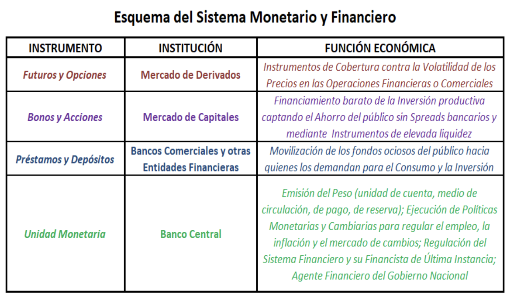

RESUMEN TEORICA 
---

- [El capitalismo contemporáneo](#el-capitalismo-contemporáneo)
    - [Breve perfil del sistema tributario argentino](#breve-perfil-del-sistema-tributario-argentino)
  - [Donde falla el mercado interviene el estado](#donde-falla-el-mercado-interviene-el-estado)
- [¿Qué estudia la macroeconomía?](#qué-estudia-la-macroeconomía)
- [Crecimiento y desarrollo económico](#crecimiento-y-desarrollo-económico)
  - [Factores condicionantes del crecimiento económico](#factores-condicionantes-del-crecimiento-económico)
  - [Causas que explican el  crecimiento de la productividad](#causas-que-explican-el--crecimiento-de-la-productividad)
  - [Crecimiento económico desigual](#crecimiento-económico-desigual)
  - [Costos del crecimiento económico](#costos-del-crecimiento-económico)
  - [¿Qué es el desarrollo y en qué se diferencia del crecimiento económico?](#qué-es-el-desarrollo-y-en-qué-se-diferencia-del-crecimiento-económico)
  - [Seis factores del desarrollo económico](#seis-factores-del-desarrollo-económico)
  - [Elementos condicionantes del subdesarrollo](#elementos-condicionantes-del-subdesarrollo)
  - [Enfoques diferentes en cuanto a políticas económicas para el desarrollo](#enfoques-diferentes-en-cuanto-a-políticas-económicas-para-el-desarrollo)
- [Teoría del ciclo económico](#teoría-del-ciclo-económico)
  - [Recesión distinto de depresión](#recesión-distinto-de-depresión)
  - [¿Qué hacer frente a la crisis?](#qué-hacer-frente-a-la-crisis)
  - [Principales aportes de la teoría keynesiana del ciclo económico](#principales-aportes-de-la-teoría-keynesiana-del-ciclo-económico)
  - [Supuestos básicos de la teoría Keynesiana](#supuestos-básicos-de-la-teoría-keynesiana)
  - [Modelo keynesiano de ingreso-gasto con precios dados](#modelo-keynesiano-de-ingreso-gasto-con-precios-dados)
    - [Función consumo](#función-consumo)
    - [Función inversión](#función-inversión)
    - [Función gasto del gobierno](#función-gasto-del-gobierno)
  - [Función demanda agregada dependiente del gasto autónomo (Ao) y del ingreso (Y) para una economía cerrada](#función-demanda-agregada-dependiente-del-gasto-autónomo-ao-y-del-ingreso-y-para-una-economía-cerrada)
  - [El multiplicador Keynesiano](#el-multiplicador-keynesiano)
  - [Herramientas de Politica fiscal: su impacto sobre producción y empleo](#herramientas-de-politica-fiscal-su-impacto-sobre-producción-y-empleo)
- [Teoría del dinero y del sistema financiero](#teoría-del-dinero-y-del-sistema-financiero)
  - [Ssitema monetario y financiero: instituciones, instrumentos y sus funciones pra la producción y el intercambio](#ssitema-monetario-y-financiero-instituciones-instrumentos-y-sus-funciones-pra-la-producción-y-el-intercambio)
    - [Instituciones](#instituciones)
      - [Bancos centrales](#bancos-centrales)
      - [Bancos Comerciales y demás EF](#bancos-comerciales-y-demás-ef)
      - [Mercado de capitales](#mercado-de-capitales)
      - [Mercado de derivados](#mercado-de-derivados)
    - [El dinero](#el-dinero)
      - [Dinero legal](#dinero-legal)
  - [Creación primaria y secundaria de dinero: balance del banco central y base monetaria / Balance de los bancos comerciales y oferta monetaria / Indicadores](#creación-primaria-y-secundaria-de-dinero-balance-del-banco-central-y-base-monetaria--balance-de-los-bancos-comerciales-y-oferta-monetaria--indicadores)
      - [Términos y aspectos operativos de las entidades financieras](#términos-y-aspectos-operativos-de-las-entidades-financieras)
        - [Sistema de encajes fraccionarios](#sistema-de-encajes-fraccionarios)
        - [Reservas bancarias](#reservas-bancarias)
      - [Circulante](#circulante)

# La Ciencia Económica y sus datos

## Economía, ciencia política. Diversidad de enfoques teóricos. Objetividad y neutralidad

La economía surge de la **necesidad** de develar los procesos sobre los cuales reposan las modernas formas mercantiles de relacionarse las personas entre sí a los fines de llevar adelante la producción y el intercambio de la riqueza social. 

> Se busca entender como los agentes privados logran resolver el **problema económico**: qué, cómo y para quién producir. 

> En sus orígenes a la economía se la llamaba **economía política** ya que el objeto de estudio es la sociedad. 

La economía registra tanto en los aportes de las escuelas de pensamiento económico como también en los principales problemas que ellas abordan, que surgen de la naturaleza conflictiva de la sociedad. 

La valoración de los problemas socio-económicos y los lineamientos para su abordaje desde el Estado se especifican de acuerdo con el ángulo y la **interpretación** de hechos complejos porque resultan de múltiples factores, **y todo ello partiendo de los supuestos de la realidad compatibles con los valores, intereses y educación de cada economista.** 

> El **problema económico** genera normalmente respuestas múltiples, todas ellas científicas aunque se muestren contradictorias entre sí. Entonces, el conflicto entre las escuelas del pensamiento económico por sostener prioridades diferentes y soluciones contrapuestas no cuestiona la validez científica de ninguna de ellas. 

El pensamiento resulta científico cuando sostiene supuestos y análisis racionales acerca de la realidad y se apoya en marcos teóricos contrastables con los hechos. 

### La economía y el maldito caracter político de su objeto

- Las características políticas de la ciencia económica explica la pluridad de escuelas en competencia. 
- Los campos de estudio resultan cuestionados y/o privados de méritos científicos si traslucen permeabilidad y funcionalidad respcto de los debátes ideológicos y políticos emergentes del conflicto social. Esto surge del paradigma de la fisica que busca ocultar las raíces políticas e ideológicas que sostienen las investigaciones científicas tanto en el campo de lo social como en el de lo natural. 
- Entonces, se debería sacrificar la pretención de neutralidad como condición de la objetividad científica en general. Esto es porque el conocimiento **pertenece a un cierto marco histórico y político**

## Leyes, Teorías y modelos Económicos

- **Ley**: describe un fenómeno
- **Teoría**: intenta explicar la ley
- **Modelos**: ofrecen un analisis detallado entre ciertas variables y aspectos específicos del fenómeno mediante graficos, algoritmos, esquemas, funciones y demás recursos análiticos y expositivos. 

> **Modelos económicos**: herramientas analíticas que mediante supuestos recortan la realidad para simplificar ciertas relaciones y comportamientos, excluyendo del estudio a los demás factores qu también actúan en el mundo real. 

Ej.: De un modelo económico cuantitativo se espera que al menos pueda captar el signo previsible y el órden de magnitud de los procesos que estudia. 

Al tratarse de modelos factores, las leyes y los modelos de la economía deben considerarse sólo como: **la descripción probable de tendencias subyacentes**. Para que una tendencia se manifieste resulta de las circunstancias contingentes que influyen sobre esas tendencias, haciendo que una se imponga sobre las demás. 

> Segun Marshall: una **ley social** es una manifestación de **tendencias sociales**, es decir, una afirmación de que puede esperarse que los miembros de cierto grupo o núcleo social adoptarán una determinada línea de comando bajo ciertas circustancias. 

Entonces, 

> Según Marshall: una **ley económica** o manifestación de tendencias económicas, son aquellas leyes sociales que se refieren a ramas de conducta en que la fuerza de los principales móviles puesde ser medida por medio de un precio en dinero. 

O sea, "la linea de comando" es la conducta que tomaran los móviles y esa conducta puede ser media por medio de un precio en dinero. 

Si alguien no sometiera su conducta a leyes económicas, con el paso del tiempo tendría problemas para garantizar su participación social e incluso su subsistencia. Ej.: vender algo muy caro o cobrar honorarios muy altos. 

## Características complejas de la información económica cuantitativa

La **información económica cuantitativa, es decir, los datos económicos** surjen de procesos de **elaboración metodológica** y su selección se funda las necesidades que plantea la teoría económica dominante.

Los **fenómenos socio-económicos** no resultan de una cuantificación puramente observacional o a partir de técnicas. 

> En la economía los aspectos de los hechos que deben explicarse, acerca de los cuales podemos obtener datos cuantitativos son **limitados** y **pueden no incluir lo más importantes**.

>Es improbable que puedan conocerse o medirse por completo todas las circunstancias que determinan el resultado de un proceso. 

Generalmente, en las ciencias sociales, se requiere como importante que resulte ser accesible a la medición, esto lleva hasta el punto de exijir que nuestras teorías se formulen en términos tales que se refieran sólo a magnitudes medibles. **Tal exigencia limita los hechos que habrán de admitirse como causas posibles de los hechos que ocurren en el mundo real.**

La medición de los fenómenos económicos impone la necesidad de **extensos textos metodológicos** para explicar de dónde salen los indicadores que se publican. 

> La **medición**, en la economía, es la mesura de una o más propiedades observables de las diversas dimensiones que componen los conceptos.

Los conceptos están compuestos de dimensiones. Los conceptos y las dimensiones observables mesuradas pueden ser un **indicador**. 

> Las **mediciones serán mejores cuanto más estrecha y directa sea la relación entre lo indicante** (la propiedad observable mesurada como indicador) **y aquello que es indicado** (el concepto o la dimensión del concepto a que el indicador refiere).

Las **cifras no proveen prueba suficiente de consistencia** entre el indicador de magnitud de un hecho o fenómeno y el concepto indicado cuyas magnitudes pretendemos conocer. 

> Esto es, no podemos garantizar que el análisis de los indicadores de un fenómeno equivalga al análisis del fenómeno real entendido en su concepto teórico.

Las cifras económicas no garantizan la obtención de diagnósticos sólidos excepto en casos de obviedad. 

--- 

En **resumen**: 

Las **cifras económicas** surgen de:
1. teorías
2. métodos de relevamiento

Pero debido al 

3. **caracter multicausal** de los fenómenos económicos y sociales

El **criterio del analísta da significado a las cifras** al darle:

4. su relevancia análitica
5. su propia interpretación

---

Un **análisis económico cuantitativo "muestra" pero no "demuestra" nada** si no se acepta su marco teórico, el procedimiento metodológico o su criterio analítico, elementos que dan significado económico a cada cifra.

El análisis de la conyuntura y de la economía en general sirve para comprender la situación actual, para determinar el signo de su evolución futura. 

Los hechos son filtrados por: 

1. "la realidad" no existe fuera de uno u otro marco teórico bajo el que se la estudia. 
2. toda descripción de la realidad económica está permeada por el enfoque particular  del analísta que la recrea. 

Cuando existan fenómenos que contradigan una determinada teoría o modelo, puede hacerse necesaria la **modifiación de ese marco teórico, preservando los componentes esenciales de ese marco.**

Por otro lado, **tampoco es una condición excluyente de todo análisis disponer siempre de cifras para explicar la vida económica.** 

> Las leyes económicas no se **manifiestan** sino en conflicto con otras y no se realizan normalmente sino **bajo la forma de tendencias**, por lo que ninguna estimación cuantitativa puede ofrecer certeza alguna. 

Una visión sólida acerca del curso de los acontecimientos **podría obtenerse en el límite, prescindiendo de los datos cuantitativos y limitándose a una evaluación cualitativa**. 

Sin cálculos matemáticos, el sentido de las tendencias futuras podría vislumbrarse por el análisis de las conductas esperables de los agentes relevantes en la coyuntura de acuerdo con el marco teórico en curso. 

# El capitalismo contemporáneo

Economías mixtas, rol del estado y del mercado, conflicto entre eficiencia y equidad, fallas del mercado. 

La **economía mixta** es la forma contemporanea del capitalismo. Operan las leyes del mercado y de la propiedad privada pero **solo parcialmente porque están acotadas por la intervención del estado.**

Entonces, La forma contemporanea del capitalismo es la economía mixta:

- La **producción y la inversión** están principalmente **a cargo del estado**.

- La **intervención del estado** regula la acción del mercado.

**Dos aspectos de la intervención del estado en la economía**
1) Las acciones de política monetaria, cambiaria, fiscal, de comercio exterior, regulación de precios y salarios, subsidios a las familias y empresas, normativa para la producción y el comercio, entre otras. 
2) La gravitación propia de su estructura organizacional (o sea, como intervienen en los mercado si no es intervención de "leyes"):
   1) en cuanto a los mercados: por el volumen de sus gastos. 
   2) en la estructura socio-ocupacional: por ser el primer empleador. 

La **competencia** de mercado, en el grado en que exista efectivamente, impulsa la **productividad** del trabajo mediante inversiones, innovación técnica en los procesos y en los productos y por consiguiente el **crecimiento** tecnológico. 

> La intervención del estado en los mercados busca compatibilizar la gestión privada de la economía con pautas gubernamentales de distribuición del ingreso. 

Los **consumidores** se esfuerzan por conseguir más a mejor precio y los **productores** reducir costos y aumentar sus ventas. 

> Esta tendencia al **ahorro de la mano de obra** y al **aumento no coordinado de la producción** suele provocar quiebras empresariales y elevados niveles de desempleo que empobrecen al a población. 

Por lo tanto, el **poder político** se elije como tutor del mercado para prevenir los efectos no deseados sobre la equidad distribuitiva a causa del dinamismo y la creciente eficiencia productiva del sistema del mercado. 

> La **regulación estatal** de la economía busca compatiblizar la dinámica productiva propia del mercado, con pautas gubernamentales de distribuición del ingreso, dadas las instituciones políticas y económicas vigentes. 

### Breve perfil del sistema tributario argentino

Un impuesto **progresivo** es aquel cuya tasa aumenta enla medida en que el ingreso gravado del contribuyente aumenta. Por el contrario un impuesto **regresivo** es aquel en que la capacidad del contribuyente no es tenida en cuenta por las alicuotas del impuesto. 

El sistema tributario argentino se basa fundamentalmente en 4 impuestos: 
- 44% IVA
- 27.5% impuesto a las ganancias
- 9.5% impuesto a los débitos y créditos vancarios
- 6% retenciones a explotación. 

Por lo tanto, nuestri sistema es netamente regresivo, y ademas, de alta complejidad de liquidación. 

Problemas del régimen impositivo de la argentina: 
- perdida de equidad provocados por mecanismo simplificados de imposición. 
- cuando se afecta la actividad económica por fines estrictamente recaudatorios. 

Un desafío primordial es pensar un sistema más progresivo y que logre escaparle a las distorsiones. Algo que permitiría distribuir mayormente la carga impositiva y reducir la necesidad de impuestos distorsivos. Incluyendo la meta de reducir la evasión. 

## Donde falla el mercado interviene el estado

# ¿Qué estudia la macroeconomía?

Se llama macroeconomía a la colección de teorías y modelos que estudian el funcionamiento de la economía de un país. 

El análisis macroeconóimico se ocupa de estudiar los niveles de:

- Producción
- Inversión
- Balanza de pagos
- Tasas de interés
- Cambio de monedas 
- Ocupación 
- Precios
- Cantidad de dinero y de crédito
- Todo lo relativo al comportamiento cíclico como al crecimiento económico
- La distribución de los ingresos
- La pobreza

> La teoría macroeconómica aporta así los fundamentos para formular las políticas económicas. 

# Crecimiento y desarrollo económico

El **crecimiento económico** es el **aumento de la capacidad de producción** o **producto potencial de un país con el paso del tiempo**. 

Se suele medir como la tasa de crecimiento alcanzada por el producto e ingreso total medido a precios constantes. Resulta de interés comparar esa taza con la evolución del producto medio por habitante (PIB percapita).

## Factores condicionantes del crecimiento económico

Existen dos enfoques:

**Enfoque clásico:** rol del trabajo y del suelo. 

De este enfoque surge un problema: con rendimientos decrecientes y cantidad fija de tierrra, la producción de alimentos tiende a crecer **menos** que la población. Por lo tanto, baja la productividad (*ley de rendimientos decrecientes a escala*) acarreando una baja del salario real y una renta creciente para el terrateniente. 

> **Rendimientos de escala**: El término rendimientos de escala aparece en el contexto de la función de producción de una empresa. Hace referencia a los cambios en la producción que resultan de un cambio proporcional en todos los inputs (Elemento que participa en un determinado proceso productivo), cuando todos los inputs aumentan por un factor constante. 
> **Rendimientos de escala se refieren a la relación existente entre la variación de los inputs de producción y la variación del output, relación más expresada en términos físicos**
> *Así, los rendimientos de escala a los que se enfrenta una empresa están impuestos exclusivamente por la tecnología y no están influidos por las decisiones económicas o por las condiciones de mercado*

**Enfoque Neoclásico:** asigna un rol al capital y el cambio tecnológico, plantea que:

1. **Necesidad de intensificar el capital**: aumento de la productividad del trabajo y salarios reales. 
2. **Cambio tecnológico mediante introducción de nuevos procesos y productos.** El cambio tecnológico, eleva las curvas de rendimientos reales del capital y la frontera de precios de factores. 

> Los factores son: trabajo, capital, naturaleza, empresa y activos.

## Causas que explican el  crecimiento de la productividad

La **PRODUCTIVIDAD** es la relación entre la producción de cierto bien y un promedio ponderado de sus factores de producción.

> Siglas utilizadas: K = capital, L = trabajo, Q = producto, w/p = salario real, i/p = tasa de interés real, g' = tasa de ganancia

1) La **intensificación del capital**: $\Delta K/ L$, la misma determina directamente la  productividad (medida como producción per capita) cuando el progreso tecnológico es cero. Por lo tanto, la productivaidad aumentará acompañando el crecimiento de la formación de capital fijo (construcciones y equipo productivo)
2) La **sustitución de insumos** por otros de mayor o menor rendimiento afecta también la evolución de la productividad. 
3) Los **avances y retrocesos de unas ramas frente a otras** afectan la productividad de la economía en función de sus productividades relativas: si avanza una industria muy productiva sube la productividad global. 
4) El aumento de los **fondos destinados a investigación y desarrollo**, con fines civiles **orientados a elevar la capacidad de la fuerza de trabajo**, incrementa la productividad. 

## Crecimiento económico desigual

Actualmente existe una enorme brecha entre países por su diferente grado de crecimiento económico. 

## Costos del crecimiento económico

La experiencia histórica, muestra que el crecimiento económico liderado por el mercado, crean lo nuevo **destruyendo impiadosamente lo viejo**. 

Características del crecimiento:

- En **pleno empleo**, el crecimiento depende de **la inversión y éste del nivel de ahorro**, este proceso puede implicar una pérdida de consumos presentes para hacer posible un mayor consumo en el futuro. 
- La manía del crecimienot conduce a una menor calidad de vida (contaminación, stress, hacinamiento).
- Suele implicar grandes cambios en la organización del trabajo (caducidad de tareas, oficios y ramas enteras de producción). Esto impone grandes desafíos económicos y políticos para minimizar el daño. 

## ¿Qué es el desarrollo y en qué se diferencia del crecimiento económico?

Deesarrollo es **crecimiento con progresos social.** El crecimiento del producto, se convierte en desarrollo económico, cuando se lleva a cabo de manera paralela con un **sostenido mayor bienestar social por mejoras obtenidas en las condiciones de vida de la comunidad.**

Algunos indicadores del grado de desarrollo económico:
- PBI por habitatnte
- Tasa de crecimiento del PBI por habitante
- Tasadde analfabetismo
- Esperanza de vida al nacer
- Tasa de inflación 
- Medicos cada 1000 habitantes
- Tasa de ahorro respecto del PBI 
- Elevado desempleo estructural
- Equidad distributiva de los ingresos
- Tasa de actividad (población económicamente activa, población en edad de trabajar)
- etc. 

## Seis factores del desarrollo económico

1) Recursos humanos (oferta laboral, educación, motivación)
2) Recursos naturales (tierra, minerales, combustibles, clima)
3) Formación de capital (máquinas, fábricas, rutas, represas)
4) Tecnología (ciencia, ingeniería, organización del trabajo, iniciativa empresarial)
5) Mododo de insercción de cada país en la economía mundial
6) Caracter y rol del estado en la promoción del desarrollo local (intereses representados, capacidad y oportunidad, dependencia, etc.)

**Ecuación fundamental de la contabilidad del crecimiento**

$$
\% \Delta Q = a \% \Delta K + b \% \Delta N +  \% \Delta tech 
$$

Q: es el crecimiento. a es el nivel de productividad. K es el stock de capital. 

## Elementos condicionantes del subdesarrollo

Factores de orden interno que **impiden a un país salir del subdesarrollo:**

1) Población enferma y desnutrida que no puede trabajar. 
2) Erradicación del analfabetismo, educación formal profesional y técnica
3) Falta de recursos naturales
4) Formación de capital y capacidad de ahorro y de obtener divisas necesarias para comprar más bienes de capital e insumos. Importancia d elas obras de infraestructura económica. 
5) Creciente dependencia del endeudamiento externo, puede crear condiciones que limiten la capacidad de encarar políticas de desarrollo con financiamiento estatal directo. 
6) Necesidad de los países atrasado de copiar innovaciones técnicas, dificultad para producirlas.

## Enfoques diferentes en cuanto a políticas económicas para el desarrollo

1) Industria versus agro
2) Mercado interno sustitución de importaciones versus exportación 
3) Especialización versus diversificación 
4) Estado versus mercado

# Teoría del ciclo económico

La economía moderna se caracteriza por su tendencia al crecimiento de la producción de manera **no lineal**.  Contiene, momentos de aceleración y de estancamiento, auges y crisis de caracter cíclico. 

> Los ciclos económicos pueden desencadenar inflación en sus fases de auge y acarren desempleo en las crisis. 

## Recesión distinto de depresión 

Una recesión es una debilidad en la demanda en dos o más trimestres, con estancamiento o contracción **no muy profunda ni dudadera** del producto y el desempleo en alza. 

Una depresión se caracteriza por una **baja anormalmente prolongada e intensa de la actividad económica y del empleo**. Puede consistir en la reinteeración de **ciclos recesivos seguidos de suaves recuperaciones antes de tomar el crecimiento.**

> Una **definición de recesión**:  es una significativa declinación de la actividad económica que se esparce a lo largo de toda la economía que dura más de unos pocos meses y normalmente es **distinguible en el PBI real**  y en los ingresos reales como también en el empleo, la producción industrial, el comercio mayorista y minorista. 

Una recesión comienza justo despues de que la economía alcanza un pico de actividad y termina cuando la economía alcanza un mínimo. **Entre pico y pico se dice qque la economía se halla en expansión.**

> Una recesión se la conoce como un **retroceso en la actividad económica**. La identificación de una recesiión con dos trimestres consecutivos de crecimiento negativo del PBI **no es una designación oficial**.

La recesión es un concepto de dimensión mensual que tienen en cuenta una serie de indicdores mensuales, como el empleo, los ingresos personales y la producción industrial, así tambien como el crecimiento trimestral del PBI. *La recesión depende de varias cosas, como el **empleo**, no solamente del decrecimiento del PBI.*

Las teorías acerca del ciclo económico y sus causas y efectos, fundamentan qué tipo de herramienta de política económica resultan apropiadas para moderar la inestabilidad macroeconómica cíclica y sus consecuencias sobre la economía y la sociedad. 

La **estructura anárquica del mercado** es un punto de partida para explicar la recurrencia de ciclos. 

La **potente dinámica capitalista del crecimento de la producción** culmina sus momentos en auge desbocada, acumulando enormes masas de nuevas inversiones multiplicando la capacidad productiva. En algún momento, **el buevo stock de capital productivo se verá excesivo** frenet a la demanda efectiva. Por lo tanto, nuevos y viejos equipos de producción compiten por ganar mercado, **quedando fuera de servicio y desvalorizando los recursos más viejos y menos eficientes.**

## ¿Qué hacer frente a la crisis? 

Tanto Keynes como otros autores explicaron la dinámica del ciclo económico como determinada por las oscilaciones de la **demanda agregada arrastrada por alzas y bajas de sus componentes autónomos**, es decir, los gastos que no se generan en función del nivel de la producción ni por los ingresos de cada momento. 

Entre los componentes autónomos de la demanda, el factor más relevante para explicar el ciclo económico es **la inversión productiva**.

En ausencia de intervención estatal o comercio exterior, **la magnitud de las nuevas inversiones productivas (I) serían la principal componente explicativa del comportamiento de la demanda agregada.** 

El enfoque Keynesiado generó modelos teóricos que explican el funcionamiento de la economía no solamente bajo pleno empleo sino también en condiciones de un elevado desempleo de los recursos productivos. 

> **Supuesto del pleno empleo**:  conduce a adoptar modelos económicos donde cualquier disminución de los niveles de rpoducción y empleo respecto de su nivel potencial desencadenaría una baja de precios y salarios estimulante de la demanda necesaria para retornar al pleno empleo. 

Largos periodos de desempleo tirarían a bajo esta teoría cediendo lugar a la **intervención del estado en el mercado.**

Keynes criticaba la los clásicos que se oponían a la intervención del estado (imponiendo salarios mínimos) ya que entendía que la causa del desempleo duradero **radica en la insuficiencia de la demanda efectiva de la comunidad para dar trabajo** a todos los que aceptarían el nivel vigente de salarios. 

Keynes señala que:

1) La desocupación no puede corregirse con la baja de salarios porque los sindicatos toleran bajas hasta ciertos límites que impiden que se recuperen cantidad signficativa de puestos de trabajo. 
2) En condiciones depresivas del mercado ello podría desencadenar una caída mayor de los precios, con la correspondiente suba del salario real. 
3) Aún suponiendo que se logra una baja en el salario real, su efecto sobre la demanda agregada y el empleo dependería del resultado neto entre la correspondiente caída del consumo corriente ny el esperado aumento en la demanda de bienes de capital por la disminución del costo de producción. 

La teoría keynesiana constata que las coyunturas con desempleo son, en la economía moderna, más numerosas que las de pleno empleo, que los mercados auto regulados pueden demorar excesivamente el retorno a situaciones de equilibrio y que al pleno empleo se llega por casualidad o deliveradamente. 

## Principales aportes de la teoría keynesiana del ciclo económico

Según keynes sólo existe un punto de equilibrio, un sólo nivel de ocupación en el que coinciden la demanada y la oferta globales, y normalmente, ese punto de equilibrio en el nivel de la actividad económica **resulta insuficiente para alcanzar el pleno empleo.**

Una teoría que toma en cuenta el desempleo de la actividad económica bajo tanto en **pleno empleo y en desempleo**.

## Supuestos básicos de la teoría Keynesiana

**1ro)** Un nivel significativo y duradero de desempleo resulta habitual en el funcionamiento de la economía moderna. 

**2do)** Habiendo desempleo y capacidad productiva ociosa, un aumento de la demanda agregada puede elevar el nivel de la actividad económica y disminuir el desempleo. 

**CONCLUSIÓN 1)** a corto plazo, el nivel de ingreso real Y dependerá de la demanda agregada DA. 

**3ro)** La experiencia indica que, sin intervención estatal ni del comercio exterior, las decisiones empresarias de invertir o no en equipo productivo y contrucciones explican las alzas y bajas del ciclo económico. 

**4to)** La inversión en bienes de capital (I) es autónoma respecto del ingreso, es decir, no depende del nivel de  ingreso real (Y) en el presente sino de las expectativas acerca de la rentabilidad que podrían rendi en el futuro esas inversiones. De manera similar, el gasto del gobierno (G) depende de las decisiones políticas y las exportaciones X del tipo de cambio y del nivel de actividad de otras economías. Por eso, son ejemplo de **gastos autónomos que integran la demanda agregada.**

**5to)** En cambio, **el consumo corrente de las familias (C)** es fuertemente dependiente del nivel de ingreso (Y) y, por lo tanto, se acomoda al ciclo económico. 

**CONCLUSIÓN 2)** El nivel de la demanda agregada (DA) depende de la demanda autónoma "A", también llamada "gasto autónomo": DA = f(A). Siendo Y = f(DA) y C = f(Y), se infiere que, cuanto mayor sea el gasto autónomo A en un periódo, tanto mayores serán consumo, ganancias, empleos y masa salarial, entre otras variables. 

**6to)** La ley de Say niega la insuficiencia general de la demanda porque la producción  generaría ingresos y, así, su propia demanda. De acuerdo con Keynes esta noción es válida sólo si hay pleno empleo. Pero se convierte en un dogma peligroso durante una depresión porque las necesidades de las personas que se reuelven a través del mercado (comida, vivienda, etc) no pueden esperar mucho tiempo hasta que la economía se vuelva a recuperar. Para keynes, **al pleno empleo se llega por casualidad o deliveradamente.**

**7mo)** Todo aumento del ingreso se convierte en mayores consumos pero no totalmente porque una porción del nuevo ingreso de la comunidad se destina al ahorro. 

**CONCLUSIÓN 3)** Es incorrecto que, para que aumente la inversión productiva (I), deba esperarse un aumento del ahorro que resulte en un descenso de las tasas de interes. Un aumento de la inversión I repercute en mayores ingresos y así en los ahorros necesarios para financiar esa nueva inversión. 

**8vo)** Las tasas de interés se forman en el mercado de dinero, donde  la demanda de dinero L expresa la preferencia por la liquidez y depende principalmente del sector privado mientras que la oferta de dinero (M/P) resulta de una decisión de política monetaria a cargo del banco central. 

**CONCLUSIÓN 4)** Los bancos centrales pueden estimular a la inversión I fomentando tasas bajas de interes a través de politicas expansivas de la disponibilidad de crédito. 

**CONCLUSIÓN 5)** Cuando las políticas monetarias no resulten efectivas para revertir un elevado desempleo, debe elevarse el ingreso disponible (YD = Y + TR - T) reduciendo el ahorro del gobierno mediante mayores gastos corrientes, obras públicas y subsidios o menores impuestos. 

### Un abordaje pre-keynesiano

Kalencki planteo: 

Demanda agregada = consumo asalariados + consumo de capitalistas + inversión en bienes de capital

Ingreso = consumo de asalariados + plus valor

- Omite al estado y al comercio exterior
- Plusvalor que incluirá 
  - la porción del ingreso con que los capitalistas financian su inversión productiva (ahorro de capitalistas) 
  - más la porción del ingreso aplicada al consumo de sus familias, suponiendo que el ahorro del asalariado es cero. 
- E**l nivel de consumo de los asalariados depende tanto de la cantidad de trabajadores ocupados como del nivel de las remuneraciones al tarbajo**. Ambos factores dependeránde las alzas y bajas del nivel de producción dispuestos por los capitalistas. 
- El consumo de los capitalistas es estable. Entonces, el nivel de consumo correinte de las familias es dependiente de los ciclos de la producción y empleo. 
- **Suponiendo la existencia de desempleo, las decisiones de inversión productiva en bienes de capital sí serían capaces de desencadenar ciclos económicos contemporaneos que se mueven en función de las expectativas empresarias de ganancias futuras**, con relativa independencia del presente de ingresos, demanda y producción. 
- La naturaleza autonoma respecto del nivel de producción e ingresos se dará no solo en la inversión productiva sino también a otros componentes de la demanda tales como el gasto público y el comercio exterior, **compartiendo esa capacidad de influir por si mismos sobre el ciclo económico.**

**Paradoja del sistema del mercado (Kalencki)**

Los capitalistas tomados en conjunto, ganarán más cuanto más gasten en bienes de capital y consumo. Pero esta inversión no motoriza el ciclo porque aumente la capacidad producitiva sino por el **efecto reactivador del gasto y producción de esos bienens junto con los nuevos empleos que ello requiere.**

## Modelo keynesiano de ingreso-gasto con precios dados

Modelo orientado a **analizar el funcionamiento de la economía durante una crisis.** No se espera que los precios se alteren. 

Este modelo pone **Y en función de la DA**. La **DA** se modificará en función de cambios que se produzcan en algunos de sus componentes **autónomos** (que no dependen de Y: **A** o **Ao**)

En el caso de una economía cerrada con el exterior, el modelo se apoya en funciones de comportamiento relativas al consumo corriente de las familias **C**. 

La función **C** depende principalmente del nivel de ingresos, pero también en componentes autónomos de la demanda agregada o gasto autónomo **A**, como el caso de la inversión **I** y del gasto del gobierno **G**. 

En el caso de una economía abierta a las funiones ateriores se le agregan las funciones de exportación **X** e importación **IMP**.

---
Siglas:

- Y: ingreso
- A ó Ao: gasto autónomo
- X: exportaciones 
- IMP: importaciones
- C: consumo de las familias o función consumo. 
- G: gasto del gobierno. 
- Co: la parte del consumo explicado por el nivel de riqueza y otros factores diferentes de Y. 
- Io: la demanda de bienes de capital explicada por ls expectativas de ganancia. 
- PMgC: procensión al cosumo: relación entre el consumo corriente de las familias y el nivel de ingreso.
- Impacto positivo de TR sobre el C: PMgC (PMgC*TR)
- Eecto negativo de los impuestos T sobre C dada PMgC (-PMgc * T)

---

En algunos casos A podría incluir a: Co, Io, el impacto postivo de TR e impacto negativo de T.

### Función consumo

Los factores que determinan esta función pueden ser muchisimos e inmanejables. Por lo tanto, nos quedamos con: nivel de ingreeso, propensión al consumo y Co, parte del consumo explicado por el nivel de riqueza y otros factores diferentes de Y. 

C = Co + PMgC * YD

Co es la parte de consumo que no depende del nivel de ingreso, sino que recoge la influencia sobre el consumo de numerosos factores y, principalmente, el nivel de riqueza. 

PMgC es la propensión al consumo, es decir, la relación entre el consumo corriente de las familias y el nivel de ingreso. *Cuanto más rica es una familia o economía, mayor será su capacidad de ahorro y, por lo tanto, menor tendrá que ser la PMgC.*

La PMgC es menor que 1 dado que las familias (psicologicamente) no destinan la totalidad de su incremento de ingresos al consumo, sino también en parte al ahorro. 

$\Delta Y > \Delta C$ dado que $\Delta Y = \Delta C + \Delta Ah$ . Como el consumo aumenta en un valor menor que el ingreso, se genera un nuevo ahorro. Para que se recupere una economía en crisis, la brecha positiva de ahorro entre la recuperación del ingreso y la del consumo tendrá que se cubierta con la inversión:  $\Delta Y - \Delta C = \Delta I$

Para que no frene la recuperación, las inversiones deben subir hasta el punto donde la nueva demanda de bienes de capital permita absorver la totalidad del nuevo ahorro generado por la recuperación. 

Adicionalmente sabemos que el YD = Y + TR - T

---

**FUNCIÓN CONSUMO**

C = Co + PMgC * (Y + TR - T)

C = Co + PMgC * Y + PMgC * TR - PMgC * T

**Esta función consumo, permite estimar los efectos que sobre el consumo pueden tener dos improtantes acciones del estado: los subsidios y los impuestos.**

---

### Función inversión

Esta función de comprotamiento incluye a la inversión privada, porque la pública obedece criterios políticos y no leyes del mercado. 

La inversión tiene dos determinantes principales:
- Las expectativas de rentabilidad de los proyectos de inversión factibles
- Las tasas de interés de mercado. 

---

Siglas:

Io: monto de los planes de inversión que habría si la tasa de interés fuera nula. 

Esa magnitud decrece en una proporción b de los valores positivos que asuma la tasa de interés i.

**FUNCION INVERSIÓN**

I = Io - b * i

---

### Función gasto del gobierno

EL gasto del gobierno, resulta **autónomo** respecto del ingreso, las tasas de interes y cualquier otra variable del mercado, porque es una decisión del gobierno. 

Su magnitud no se ajusta a los cambios que se produzcan a nivel de la actividad económica, sino de aceuro con el criterio del gobierno que, en muchos casos, **tenderá a modificar su gasto en un sentido contrario a las tendencias del mercado.**

## Función demanda agregada dependiente del gasto autónomo (Ao) y del ingreso (Y) para una economía cerrada

De la combinación  de las funciones anteriores surge la función demanda agregada dependiente de Y y el llamado *modelo básico keynesiano* donde se reexpresa DA = C + G + I de las cuentas nacionales, por un modelo teórico donde esos agregados y, por lo tanto, la DA, se reexpresan en función de sus factores determinantes. 

---

**FUNCIÓN DEMANDA AGREGADA**

DA = Co + PMgC * Y + PMgC * TR - PMgC * T + G + Io - bi

---

La expresión en terminos de cuentas nacionales contenía un registro histórico, para la expresión análoga en terreno de la teoría macroeconómica contiene hipótesis científicas acerca del comportamiento probable de los agentes económicos. 

Para simplificar, podemos agrupar como gasto autónomo o demanda autónoma, bajo la sigla AO, a los componentes de la DA cuyo comportamiento no depende del nivel de ingreso (Y). Si consideramos que **la tasa de interés está controlada por el banco central y, por lo tanto, no cambiará en función del nivel de ingreso si no de la política monetaria**, entonces, podemos incluirla en la determinación del gasto autónomo.

Gasto atuónomo = Ao - bi = Co + PMgC * TR - PMgC * T + G + Io - b * i

DA = Ao + PMgC * Y - b*i

## El multiplicador Keynesiano

El modelo del multiplicador keynesiano ("mk") sirve para **estimar la magnitud de las medidas de política económica** para conseguir cierto objetivo de **ocupación e ingresos.**

Permite estimar la relación entre la cantidad de nuevos gastos "autónomos" corregidos por el efecto de las tasas de interes necesaria para que cierta magnitud del cambio que se desea incluir en el nivel de ingreso real  (Y) tal que deje a la economía en un nuevo equilibrio donde Y = DA. 

---

**FORMULAS DEL MULTIPLICADOR KEYNESIANO**

$$
mk = \frac{\Delta Y^*}{ \Delta (Ao - b * i)}
$$

De manera análoga tenemos que: $\Delta Y^* = mk \Delta G = mk * \Delta I = mk * \Delta(Ao - b * i)$

Se lo puede calcular como la inversa de la propensión al ahorro:

$$
mk = \frac{1}{1 - PMgC}
$$

---

El multiplicador keynesiano es el resultado de un proceso económico consistente en que un cambio en el gasto autónomo, es decir, en los componentes de la demanda agregada no dependientes del nivel de ingreso, es una nueva demanda solvente de bienes y servicios que deben ser producidos.

 Como la producción con destino a esa demanda genera nuevo ingreso por igual valor, tal ingreso se convertira en nuevos consumos en la proporción dada por la PMgC, de valor siempre inferior a la unidad, lo que a su vez vuelve a aumentar el ingreso y así una serie infinita de sumandos decrecientes.

Un aumento de la demanda autónoma, determina un efecto mayor que una reducción en los impuestos, mayores TR o menores T no consituyen en sí demanda agregada sino cmponentes del ingreso disponible Y, por ello, al modificarse su valor, se verá modificado el consumo corriente de las familias. 

## Herramientas de Politica fiscal: su impacto sobre producción y empleo

Los gastos o el endeudamiento incurridos para atender a las necesidades económicas propias del funcionamiento del aparato del estado **implicaron siempre algún grado de influencia, deliberada o no, sobre el mercado y las actividades productivas.**

La **política fiscal**, entendida como el **manejo del presupuesto público como herramienta económica** impulsada en parte por la carrera armamentista y también tras el objetivo del pleno empleo de la mano de obra. 

En **economía** se denomina **política fiscal** al uso que hace un gobierno del presupuesto público a fin de influir deliberadamente en algún aspecto del ámbito de la producción y la circulación de bienes, los precios e ingresos y el trabajo. 

Si el objetivo es **aumento del nivel de empleo** -> promover una **expansión** de la demanda agregada, el ingreso y el empleo:
- Aumentando el **gasto gubernamental** .
- Aumentando TR. 
- Reduciendo T, crese el ingreso que queda disponible para el consumo familiar.

Si a la par del aumento del gato estatal G, aumentaran también los impuestos T, para garantizar genuino financiamiento prescindiendo de todo endeudamiento, esos mayores impuestos reducidirían sustancialmente el ingreso disponible y, con ello, el consumo corriente de las familias C, teniendo a anular el efecto potencialmente expansivo de aumentar el gasto estatal G sobre el nivel de actividad. 

Si el objetivo es **combatir la inflación** -> promover una **contracción** de la DA y, a partir de ahí, del ingreso, los precios, y el empleo: 
- Reducir el **gasto del gobierno**
- Reducir TR
- Aumentar los impuestos

Esto es aplicable si el objetivo gubernamental es **atacar la inflación**, es decir, manejando el presupuesto nacional para desalentar la producción y el empleo. Por sus efectos **recesivos** tanto en el plano laboral como empresario, se suelen desarrollar **políticas alternativas** orientadas a la contención del alza de los precios, incluyendo la regulación gubernamental de  los precios y los salarios o bien la promoción de compromisos antiinflacionarios entre el gobierno, los sindicatos y las empresas, entre otras iniciativas.

# Teoría del dinero y del sistema financiero

## Ssitema monetario y financiero: instituciones, instrumentos y sus funciones pra la producción y el intercambio 

La creciente y diversificada división del trabajo que acompaña al progreso técnico multiplicó no sólo la capacidad productiva sino también la necesidad de coordinación producitiva y financiera entre numerosos agentes económicos, esto es: entre proveedores con sus clientes y en la asignación de financiamientoa los productores. 

Estos mismos procesos reposan en la **existencia de una única moneda de valore relativamente estable** tanto en términos de bienes y servicios como de las monedas extranjeras. 

Las actividades vinculadas con el financiamiento de la producción y el consumo están a cargo del Banco central y de las entidades financieras:

Sin una unidad monetaria de amplia aceptación, creada por los bancos centrales, no podría exister un sistema de **intercambios generalizados** como el que caracteriza a la economía de mercados. 

La cireculación de los fondos ofrecidos por ahorristas inversores hacia las empresas y consumidores demandantes de dinero es un requisito para el crecimiento de la actividad económica. 

Los intrumentos de cobertura que se negocian en el ámbito de mercado de derivados permiten la planificación de producción y precios a mediano plazo en mercados sometidos a una elevada volatilidad. 

--- 

Una **crisis** del sistema finaciero se caracteriza por una abrupta caída de la magnitud de dinero disponible para la circulación de bienes y servicios "reales", su producción y consumo. Al mismo tiempo, cae la inversión en medios de producción y se multiplican el desempleo y las quiebras empresarias.

--- 

### Instituciones

Estructura el sistema financiero instrumentando las exigencias monetarias de la producción y el intercambio. 

#### Bancos centrales

- Tiene por finalidad formular políticas monetarias que garanticen la funcionalidad de la moneda nacional promoviendo al mismo tiempo objetivos de empleo y precios en colaboración con el gobierno nacional. Estos objetivos pueden resultar contradictorios en ciertas ocasiones y requieren acuerdos entre el gobierno y el banco central. 
- Su objetivo es amortiguar ciclos económicos a través de la política monetaria, regulando el volumen de crédito disponible para la demanda y las tasas de interés. 
- Tiene a cargo la supervisión de las entidades financieras. 
- Es prestamista de última instancia de las EF en caso de crisis individual o de sistema. 
- Emisor de la moneda nacional, custodia su poder de compra tanto frente a bienes como a las monedas extranjeras. 
- Es agente financiero del gobierno. 

#### Bancos Comerciales y demás EF

- Llevan a cabo una intrmediación para movilizar fondos entre depositantes y prestarios. 
- Percibe una tasa de interés por sus préstamos (tasa activa) que debe ser superior a la tasa que paga a sus depositantes (tasa pasiva) para obtener un margen (spread).
  

#### Mercado de capitales

Da transparencia al mercado de activos financieros constituído por las acciones y los bonos (títulos de deuda). Estos instrumentos captan el ahorro y la existencia de un merdado de capitales desarrollado faiclita la participación de pequeños ahorristas. 

#### Mercado de derivados

Da marco institucional a las operaciones de lanzamiento, compra y venta de futuros u opciones, tanto de compra como venta, llevadas a cabo por productores, comerciantes, financistas o inversores. La adquisición de esos intrumentos tiene fines de cobertura, es decir, para asegurarse un precio futuro de sus productos pero fijado hoy. 

### El dinero

Dinero es el tipo de mercancía, instrumento convencional o registro contable de crédito o débito que se acepta sin reparo comomedio de pago para vender y comprar. 

Un sistema de truece es inimaginable para una economía ampliamente fundada en la dividión del trabajo, de donde la desaparición del dinero paralizaría todo el circuito moderno de producción y distribución. 

En economía el concepto de dinero es, la suma de los medios de pago que dispone la comunidad para realizar sus gastos. "Suma de medios de pago" como "oferta monetaria", son formas de referirse eneconomía a la "cantidad de dinero" o "stock de dinero" en poder del público. 

Los stock de medios de pago incluye billetes, monedas, depósitos entre otros instrumentos monetarios cuya conversión en billetes y monedas puede diferirse en el tiempo. Los componentes del stock de dinero tienen diferentes grados de liquidez. 

#### Las funciones del dinero

Funciones del dinero para servir como dinero en las transacciones, comerciales y financieras. Ellas son: 

- **Medio de compra (medio de cambio o medio de circulación):** la existencia de dinero sirve para fijar a un precio a los bienes y servicios destinados a la venta. 
  
- **Unidad de cuenta**: el dinero provee un denominador común al valor de las cosas haciendo factible sumar y restar las transacciones por su valor expresado en dinero y llevar registros contables. 

- **Medio de pago**: sirve para hacer efectivas las promesas de pago convenidas cancelando la obligación en efectivo. 

- **Reserva de depósito de valor:** el dinero nacional puede atesorarse (salir de circulación) para, en el futuro, volver al circuito comercial. O bien puede despoitarse en un banco (para volver a la circulación mediante el sistema crediticio).

#### Dinero legal 

Ya no circula en el comercio las monedas de oro y plata como medio de pago. 

Para cumplir funciones de reserva de valor se maneja el dinero de papel o moneda: dinero fiduciario. Este es emitido por un baco central de un estado nacional. 

El dinero fiduciario depende de fe o confianza del público, ese papel va a desempeñar en el futuro alguna o todas las funciones que definen lo que es el dinero. El dinero papel puede o no tener respaldo en mercancías como el oro o la plata o en divisas extranjeras u otros activos de valor intrínseco. 

El uso de dinero sin valor intrínseco facilita a los gobiernos tanto la regulación del sistema de crédito sino les provee un recurso siempre a su disposición para financiar los déficits presupuestarios.

## Creación primaria y secundaria de dinero: balance del banco central y base monetaria / Balance de los bancos comerciales y oferta monetaria / Indicadores

### ¿Cómo se crea el dinero?

El dinero llega a nosotros directa o indirectamente desde los bancos comerciales y otras entidades financieras y un a parte del dinero que tenemos consiste en depósitos bancarios. La casa de la moneda u otras imprentas imprimen billetes y monedas que **encarga el banco central**, pero es este el que los convierte en dinero previamente. 

**Creación primearia del dinero:** acción del banco central de realizar pagos a las entidades financieras o al gobierno mediante sus propios billetes y monedas o bien mediante la acreditación de fondos en cuentas de depósito. Esos fondos de las entidades financieras entrarán a circular entre el público del sistema bancario. 

**Creación secundaria del dinero:** se lleva a cabo por las entidades financieras (bancos comerciales), al tomar depósitos y otorgar préstamos.

#### Términos y aspectos operativos de las entidades financieras

##### Sistema de encajes fraccionarios

consiste en que los bancos comerciales pueden dar en préstamo una fracción del dinero recibido en depósito de sus clientes. Esta característica favorece la multiplicación de medios de pago disponibles para el público pero es la **primera condición para la existencia de crisis financieras.** Esto es, ante una pérdida de confianza del público en la solvencia, las entidades provoca que los bancos se queden sin fondos para atender un masivo retiro de los depósitos.

Por lo tanto, el banco centra **obliga** a los bancos comerciantes a dejar disponible, sin prestar, parte restante de los depósitos de modo de "reserva mínimas" o encajes mínimos, legales u obligatorios.

Si las sumas en reserva no alcanzan (cunde el pánico entre los ahorristas pensando en el cierre o quiebre d elos bancos), en ese caso el banco central, **como prestamista de última instancia**, prestará el dinero necesario para que no cierren los bancos, ocasionando una catastrofe para el sistema de crédito y, através de él, para la producción y el empleo. 

##### Reservas bancarias

$C_R$: efectivo retenido en cajas fuertes de entidades financieras.
$R_D$: fondos depositados en cuenta corriente en el banco central. 

$R$: reservas bancarias

$R = C_R + R_D$

$R_L$: encajes mínimos o reservas legales u obligatorias.

$R_E$: reservas excedentes. 

$R_E = R - R_L$

En general, los bancos comerciales tienden a reducir a cero las reservas excedentes cuando ven aumentar su margen entre la tasa activa y pasiva y/o cuando el riesgo de incobrabilidad baja. 

#### Circulante

$C_p$: los billetes y monedas en poder del público.

$C_r$: los billetes y monedas de las entidades financieras. 

$C$: circulante.

$C = C_p + C_r$

La totalidad de billetes y monedas emitidos por el Banco central y, sumado a los depósitos de las entidades financieras encuenta corriente en el baco central ($R_D$). Constituyen la **base monetaria (BM)**.

$BM = C_p + R = C + R_D =  C_p + C_r + R_D$

Las familias y las empresas reparten su dinero entre efectivo ($C_p$) y depósitos (D).

